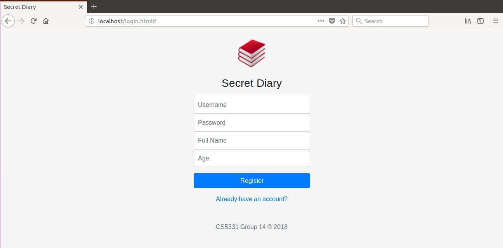

# rest-api-development

CS5331 Assignment 1 Project Reference Repository

## Instructions

The objective is to implement a web application that provides the endpoints
specified here: https://cs5331-assignments.github.io/rest-api-development/.

## Screenshots

1. User Sign-up.

2. User Log-in.

3. View public diary entries.

4. View user's public and private entries. (Toggle permission and delete entries)

5. Create new diary entry.

5. View user profile.

## Administration and Evaluation

### Team Members

1. **Luis Vazquez Diaz**
2. **Divya Kamal Maddi**
3. **Anusha Anandan**
4. **Kowshik Sundararajan**

### Short Answer Questions

#### Question 1: Briefly describe the web technology stack used in your implementation.

Answer: Our tech stacks consists of:
* Backend: NoSQL database (MongoDB)
* Server: Node.js with Express framework and Mongoose wrapper for MongoDB
* Front-end: HTML, CSS, JavaScript, jQuery, Bootstrap4

#### Question 2: Are there any security considerations your team thought about?

Answer: We considered the following security measures (have not implemented them):
* XSS defenses by input/output sanitization and escaping.
* CSRF defenses by using tokens and checking origin header.
* Implementing CSP to prevent general injection attacks.
* Password requirements (length, special characters, etc)

We have implemented the following:
* NoSQL injection defenses (implemented by using Mongoose prepared statements).

#### Question 3: Are there any improvements you would make to the API specification to improve the security of the web application?

Answer: Since the token is sent in cleartext, session hijacking can take place.

#### Question 4: Are there any additional features you would like to highlight?

Answer: We have implemented the following features:
* Password security: Using a combination of hashing and salts.
* We implemented a whitelist such that only http://localhost:80 can make requests to the API.

#### Question 5: Is your web application vulnerable? If yes, how and why? If not, what measures did you take to secure it?

Answer: Yes, the web application is vulnerable to the following types of attacks:
* XSS: inputs and outputs are not sanitized, html and urls are not escaped.
* CSP: No implementation of CSP directives allows for injection of malicious scripts.
* Lack of auto expiry of auth token can leave the app vulnerable if an attacker gains access - CSRF.
* Unencrypted traffic - opens the gate for MiTM attacks.

#### Feedback: Is there any other feedback you would like to give?

Answer: There are inconsistencies with the API documentation. `/diary/delete` should be implemented using `DELETE` verb and `/diary/permission` should be implemented using `PUT`. 

Appreciate the flexibility in choosing our own tech stack, however with lack of experience in Docker, it has been quite difficult.

### Declaration

#### Please declare your individual contributions to the assignment:

1. **Luis Vazquez Diaz**
    - Implemented Docker

2. **Divya Kamal Maddi**
    - Front-end
    - Documentation

3. **Anusha Anandan**
    - Server-side
    - Database
    - Front-end

4. **Kowshik Sundararajan**
    - Server-side
    - Database
    - Front-end
    - Documentation

